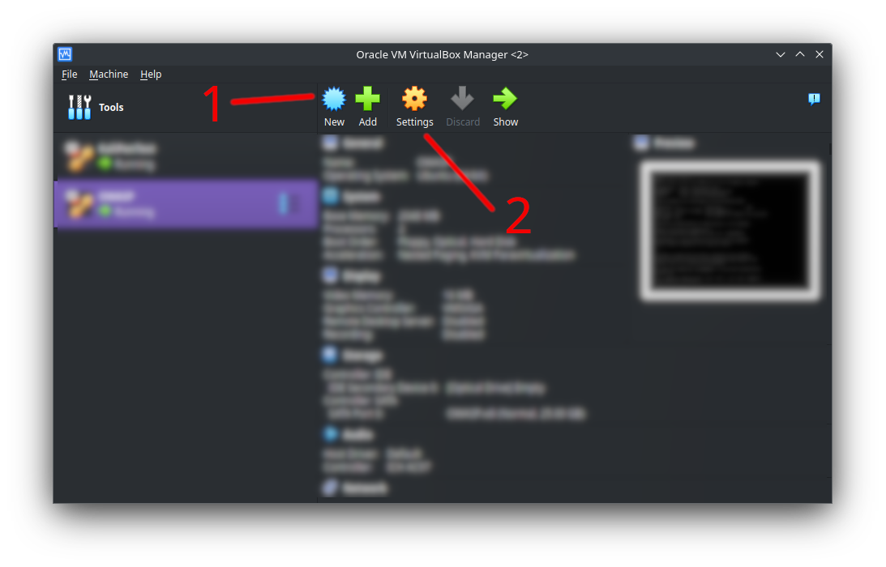

# Installation

I will describe almost full installation, starting with installing VirtualBox and creating and configuring VM, ending with accessing the working website. 
I will use Ubuntu 24.04.3 LTS as OS, Apache2 as web-server, php 8.2 and MariaDB as database server. 
My host OS is EndeavourOS. In case you use Windows, the only difference is in installing the VirtualBox. You can find Windows instructions on web and/or use any other hypervisor. 
Be sure, that virtualization is enabled in your BIOS settings! On AMD CPUs it is named as **AMD-V** and on Intel CPUs it is named as **Intel VT** (Intel Virtualization Technology). In case you don't want or can't enable virtualization on your host, you could **proceed with your host OS**, but this way **should be avoidable in any ways!**

## Installing the VirtualBox

In case you use Arch linux too, the VirtualBox should be available via package manager. Just use `sudo pacman -S virtualbox virtualbox-guest-iso`. 
Not sure about other distros, so you can visit [official VirtualBox site](https://www.virtualbox.org/wiki/Linux_Downloads) and download required package. The install it with `sudo dpkg -i downloaded_file.deb`, `sudo dnf install downloaded_file.rpm` or with another package manager from your system.

## Creating the VM

- Go to [Old Ubuntu Releases](https://old-releases.ubuntu.com/releases/) page and press **Ubuntu 22.04.3 LTS (Jammy Jellyfish)**;
- Find and click **ubuntu-22.04.3-live-server-amd64.iso** to download installation iso file. It should be at the bottom of the page. Or you can just press [this link.](https://old-releases.ubuntu.com/releases/jammy/ubuntu-22.04.3-live-server-amd64.iso);
- Start VirtualBox. We would need only two buttons: **New (1)** and **Settings (2)**;

