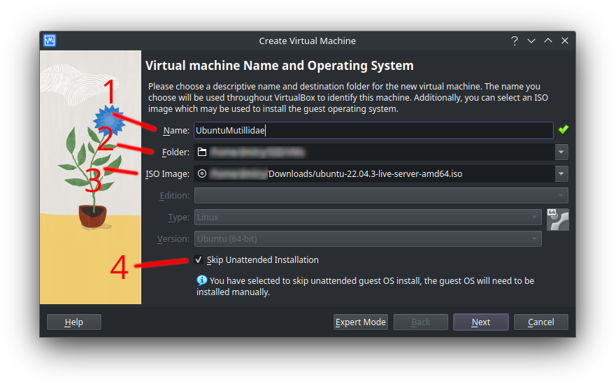
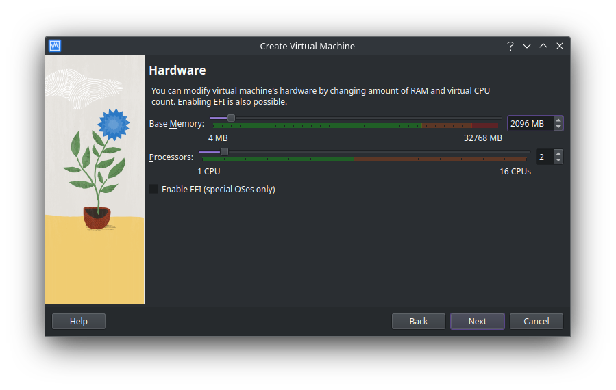
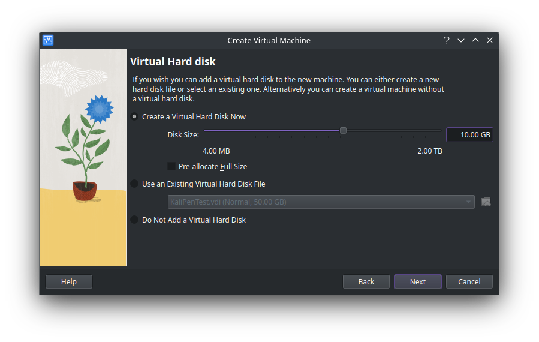
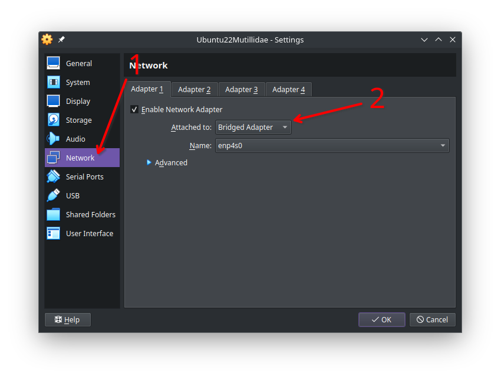

# Installation

I will describe almost full installation, starting with installing VirtualBox and creating and configuring VM, ending with accessing the working website.<br>
I will use Ubuntu 24.04.3 LTS as OS, Apache2 as web-server, php 8.2 and MariaDB as database server.<br>
My host OS is EndeavourOS. In case you use Windows, the only difference is in installing the VirtualBox. You can find Windows instructions on web and/or use any other hypervisor.<br>
Be sure, that virtualization is enabled in your BIOS settings! On AMD CPUs it is named as **AMD-V** and on Intel CPUs it is named as **Intel VT** (Intel Virtualization Technology). In case you don't want or can't enable virtualization on your host, you could **proceed with your host OS**, but this way **should be avoided in any ways!**

## Installing the VirtualBox

In case you use Arch linux too, the VirtualBox should be available via package manager. Just use `sudo pacman -S virtualbox virtualbox-guest-iso`.<br>
Not sure about other distros, so you can visit [official VirtualBox site](https://www.virtualbox.org/wiki/Linux_Downloads) and download required package. Then install it with `sudo dpkg -i downloaded_file.deb`, `sudo dnf install downloaded_file.rpm` or with another package manager from your system.

## Creating the VM

- Go to [Old Ubuntu Releases](https://old-releases.ubuntu.com/releases/) page and press **Ubuntu 22.04.3 LTS (Jammy Jellyfish)**;
- Find and click **ubuntu-22.04.3-live-server-amd64.iso** to download the installation iso file. It should be at the bottom of the page. Or you can just press [this link.](https://old-releases.ubuntu.com/releases/jammy/ubuntu-22.04.3-live-server-amd64.iso);
- Start VirtualBox. We would need only two buttons: **New (1)** and **Settings (2)**;


- Press **New (1)** button. The new window would appear.



1. Enter any conveninent name for new VM. It's up to you;
2. Choose the folder, where the subfolder with all required files for this VM would be created. Assume, that this path is "/home/user/VMs" and VM's name is "Test VM", all VM's files would be placed in "/home/user/VMs/Test VM" folder;
3. Choose downloaded previously iso installation image;
4. Check this box to disable automatic OS installation to configure it manually. Then press **Next** button.



- Configure RAM and CPUs availbale for VM. For our puproses it would be enough to set 1024MB RAM and 1 CPU. Press **Next**.



- Specify the VM's disk size. 10GB would be enough in our case. By default, the disk image's size would be minimal and would be expanding as needed. To allocate full size from the beginning check the corresponding checkbox. Then press **Next**.


- Here you could check all the configuration parameters. If everything is fine, then press **Finish** button and wait a bit, while VM is creating. It would be enough fast;
- Then press the **Settings** button from the first screenshot. The VM's configuration window would appear.



- Open **Network** section and change **Attached to** to **Bridged adapter**. In that mode your VM would got own IP address in your subnet, so any other hosts in subnet could access it. It's the simpliest way. You can check [VirtualBox documentation](https://www.virtualbox.org/manual/ch06.html) to know more about network modes in VirtualBox;
- After changing network settings, press **Ok** button;
- Launch the VM via **Start** button and wait until the initial OS configuration window would appear.

I wouldn't describe the OS installation, because it's enough simple and there are plenty of instructions on the web. Nothing special should be configured during installation, but I recommend to enable **ssh server** checkbox;

## Services installation

We need to install database server (MariaDB), PHP and web-server (Apache).

### MariaDB installation

- Run `sudo apt install -y mariadb-server` and wait until installation is completed;
- Enter the database server, entering `sudo mysql`;
	- Set the password for root user, using `ALTER USER 'root'@'localhost' IDENTIFIED BY 'my_password';`;
	- Create database, entering `CREATE DATABASE mutillidae;`;
	- Exit from database management with `quit`;

### Apache installation

- Install Apache web-server with `sudo apt install -y apache2` command;

### PHP installation

- Enable PHP PPA repository with `sudo add-apt-repository ppa:ondrej/php`;
- By default, php8.3 is installed in Ubuntu 22.04.3. Check installation with `php -v` command;
	- If it's installed, then install required packages with `sudo apt install libapache2-mod-php php8.3-{cli,fpm,xml,curl,mbstring,intl,mysql}`;
	- If it isn't installed, then install PHP and required modules with `sudo apt update && sudo apt install -y php8.2 libapache2-mod-php php8.2-{cli,fpm,xml,curl,mbstring,intl,mysql}`

### Mutillidae installation

- Now `cd /var/www` or into any other folder, which web-server could access and clone the mutillidae repo from github with `sudo git clone https://github.com/webpwnized/mutillidae.git`;
- Edit `sudo vi /var/www/mutillidae/src/include/database-config.inc` and change only **DB_PASSWORD** to those, which you set for root user in MariaDB. The save and exit with **Shift+:** and **wq**;

Now we need to configure Apache web-server to serve this directory with service in it. Follow next steps:

- Run `cd /etc/apache2` to cd into web-server config directory;
- Run `sudo a2dissite 000-default && sudo a2enmod rewrite` to disable default welcome page and enable rewrite mode;
- Run `sudo vi ./sites-available/mutillidae.conf` and paste here the following config:

```apacheconf
<VirtualHost *:80>
	ServerName mutillidae.localhost
	ServerAlias www.mutillidae.localhost mutillidae
	DocumentRoot /var/www/mutillidae/src
	Include conf/headers.conf
	Include conf/error-pages.conf

	<IfModule dir_module>
    		DirectoryIndex index.php
	</IfModule>

	<Directory /var/www/mutillidae/src>
		AllowOverride All
		Options +Indexes +FollowSymLinks +MultiViews
		Require all granted
	</Directory>

	ErrorLog ${APACHE_LOG_DIR}/mutillidae-error.log
	CustomLog ${APACHE_LOG_DIR}/mutillidae-access.log combined
</VirtualHost>
```

- Then run `sudo cp -r /var/www/mutillidae/src/configuration/apache-configuration/conf /etc/apache2`;
- Run `sudo bash -c 'cat /var/www/mutillidae/src/configuration/hosts-file/hosts > /etc/hosts'`
- Run `sudo systemctl restart apache2 php8.3-fpm`.

Now you can try to access this server from yout browser, just entering it's IP, which could be found with `ip -brief a`, for example.
